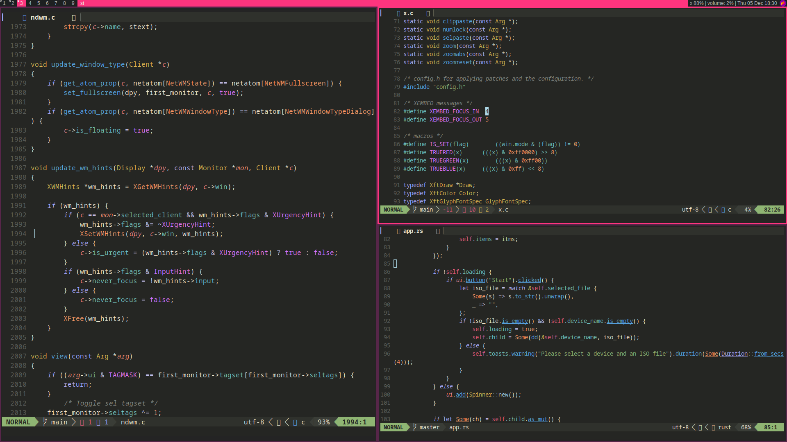
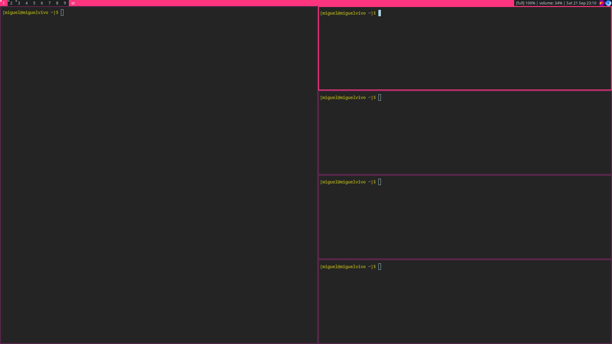

# ndwm



NDWM is a dynamic window manager for X11, based on DWM.

## Requirements

In order to build this project, you need:

- C99 Compiler
- GNU Make
- libx11
- libfreetype2

## Build

You can build this project by running `make`:

```sh
make
```

The executable will be located at the `bin` directory.

## Install

Enter the following command to build and install (if necessary, run it as root):

```sh
make clean install
```

By default, the program is installed in `/usr/local/bin`.

## Usage

Put **ndwm** in your `.xinitrc` file or other startup script to start the window manager. It's also recommended to use **ndwm** with a status bar, such as **sblocks.** If you choose to do so, your `.xinitrc` file should look something like this:

```
sblocks &
exec ndwm
```

## Features

- [x] System tray support
- [x] Fullscreen mode on windows
- [x] Configurable keybindings
- [x] Sane defaults
- [x] Configurable behaviour
- [x] Configurable color scheme

## TODO

- [ ] Color scheme configuration needs to be simplified.
- [ ] Configuration should be done in a proper configuration file such as a .toml file.
- [ ] There's still a lot of nonsensical code to fix.

## Master layout

This section is under development.

## Default keybindings

By default, MODKEY is the Super button.

| Keybinding  | Action |
| ------------- | ------------- |
| MODKEY + d | Open dmenu  |
| MODKEY + Enter  | Open terminal (st)  |
| AudioMute  | Mute audio volume  |
| AudioRaiseVolume  | Raise volume  |
| AudioLowerVolume  | Lower audio volume  |
| MonBrightnessUp  | Increase the monitor brightness  |
| MonBrightnessDown  | Decrease the monitor brightness  |
| MODKEY + [1-9] | Go to tag [1-9]  |
| MODKEY + k | Focus the previous window in the stack  |
| MODKEY + j  | Focus the next window in the stack  |
| MODKEY + f  | Toggle fullscreen mode  |
| MODKEY + q  | Close window |
| MODKEY + Space  | Toggle floating mode |
| MODKEY + Left  | Go to the left tag |
| MODKEY + Right  | Go to the right tag |
| MODKEY + Shift + Left  | Move window to left tag |
| MODKEY + Shift + Right  | Move window to right tag |
| MODKEY + v  | Move the client to the next position in the stack  |
| MODKEY + j  | Focus the next window in the stack |
| MODKEY + l  | Increase the width of the master window |
| MODKEY + h  | Decrease the width of the master window |
| MODKEY + z  | Turn the focused into the master window  |
| MODKEY + Shift + r  | Quit ndwm |

## Configuration

You should configure **ndwm** by manualy editing the file `src/config.h` to match your preferences, then recompile the program.

## Screenshots


